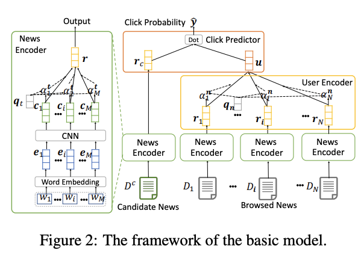

<div align="center">


**[Hackernews](https://news.ycombinator.com/news) Stories Recommendations Based on Your Favorites :rocket:**

______________________________________________________________________

<p align="center">
  <a href="#installation">Installation</a> •
  <a href="#getting-started">Using the HackerNews App</a> •
  <a href="https://01g3zbthsnjj4qq0axpycgts35.litng-ai-03.litng.ai/view/Home">HackerNews App URL</a>
</p>

[](https://pypi.org/project/hackernews-app/)
[](https://badge.fury.io/py/hackernews-app)
[](https://pepy.tech/project/hackernews-app)
[](https://join.slack.com/t/grid-ai/shared_invite/zt-pw5v393p-qRaDgEk24~EjiZNBpSQFgQ)
[](https://github.com/PytorchLightning/jax-lightning/blob/master/LICENSE)

______________________________________________________________________

</div>

## Installation

```bash
conda create --name hackernews_app python=3.8
conda activate hackernews_app

git clone https://github.com/PyTorchLightning/hackernews-app.git
cd hackernews-app
pip install -r requirements.txt
```

## Getting Started

### Running the App

```bash
## To run the app locally
lightning run app app.py

## To run the app on the cloud to share it with your peers and users
lightning run app app.py --cloud
```

### User Journey

1. User enters their username on the [UI](https://01g3zbthsnjj4qq0axpycgts35.litng-ai-03.litng.ai/view/Home)
1. We show a list of personalized HackerNews stories to the user based on their favorites.
1. User has the option to filter the recommendations based on the topics they are interested in.

## Technical Guide



**. Terminology:**

1. Browsed News: Stories from the favorites API.
1. Candidate News:
   1. Positive Samples: Favorites API
   1. Negative Samples: Stories from different topics
1. News Encoder: Will run on each story

### TODO: App Flow:
