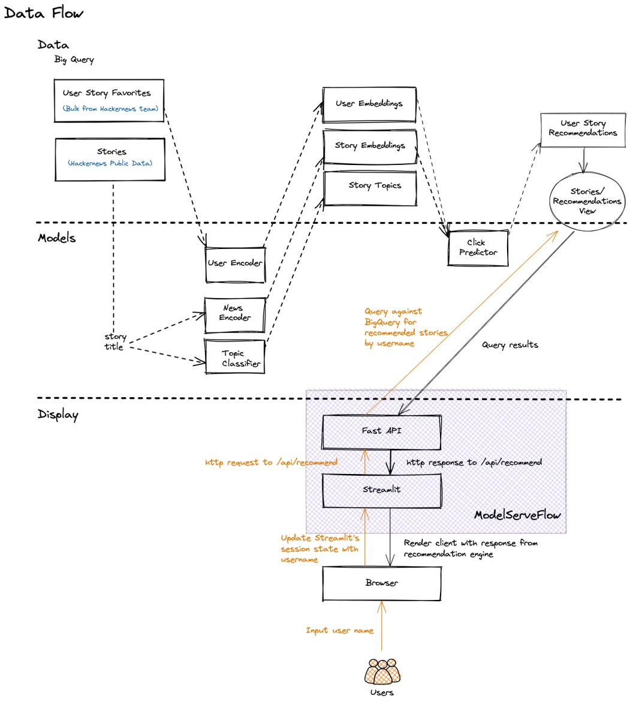
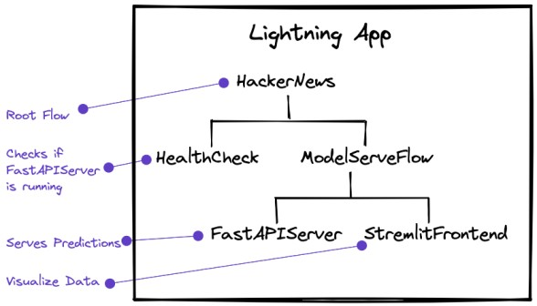

<div align="center">


**[HackerNews](https://news.ycombinator.com/news) Stories Recommendations Based on Your Favorites :rocket:**

______________________________________________________________________

<p align="center">
  <a href="#installation">Installation</a> •
  <a href="#getting-started">Using the HackerNews App</a> •
  <a href="https://01g3zbthsnjj4qq0axpycgts35.litng-ai-03.litng.ai/view/Home">HackerNews App URL</a>
</p>

[](https://pypi.org/project/hackernews-app/)
[](https://badge.fury.io/py/hackernews-app)
[](https://pepy.tech/project/hackernews-app)
[](https://join.slack.com/t/pytorch-lightning/shared_invite/zt-pw5v393p-qRaDgEk24~EjiZNBpSQFgQ)
[](https://github.com/PytorchLightning/hackernews-app/blob/master/LICENSE)

______________________________________________________________________

</div>

## Installation

```bash
conda create --name hackernews_app python=3.8
conda activate hackernews_app

git clone https://github.com/PyTorchLightning/hackernews-app.git
cd hackernews-app
pip install -r requirements.txt
pip install -e .
```

## Getting Started

### Running the App

```bash
## To run the app locally
lightning run app app.py

## To run the app on the cloud to share it with your peers and users
lightning run app app.py --cloud
```

### User Journey

1. User enters their username on the [UI](https://01g3zbthsnjj4qq0axpycgts35.litng-ai-03.litng.ai/view/Home)
1. We show a list of personalized HackerNews stories to the user based on their favorites.
1. User has the option to filter the recommendations based on the topics they are interested in.

### Design

The current design runs batch predictions on users who favorited at least one story. We plan to introduce
model training within the HackerNews app in the future, for now we're using the
[PyTorch Lightning App](https://lightning.ai/app/AU3WoWwdAP-Train%20%26%20Deploy%20PyTorch%20Lightning) to train
models prior to loading their predictions into BigQuery:

<details>
    <summary>Data Flow Design: Offline Training and Batch Predictions</summary>
    </img>
</details>

<details>
    <summary> Lightning App Design </summary>
    <p>
        The main component, ModelServeFlow, orchestrates the communication between FastAPIServer and a Streamlit
        frontend. Since Streamlit has it's own state that manages user sessions, we pass Lightning app state to
        the Streamlit App State.
    </p>
    </img>
</details>
